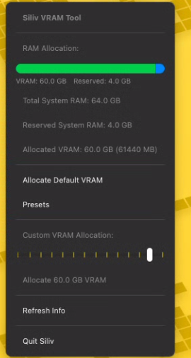

<div align="center">
  <h1>Siliv</h1>
  
  <p>
    <strong>Siliv</strong> (<em>Sili</em>con <em>V</em>RAM) — A simple macOS menu‑bar utility to adjust Apple Silicon GPU VRAM allocation
  </p>
  <p>
    <a href="https://github.com/PaulShiLi/Siliv/actions/workflows/release.yml">
      
    </a>
    <br>
    <a href="https://github.com/PaulShiLi/Siliv/releases/latest">
      
    </a>
    <a href="https://github.com/PaulShiLi/Siliv/issues">
      
    </a>
  </p>
  <p>
    <strong>Topics:</strong>
    <code>macos</code> <code>apple-silicon</code> <code>vram</code> <code>menu-bar</code> <code>python</code>
  </p>
</div>

---

## 📋 Table of Contents

- [About](#about)  
- [Quickstart](#quickstart)  
- [Features](#features)  
- [Requirements](#requirements)  
- [Installation](#installation)  
- [Running from Source](#running-from-source)  
- [Building a .dmg](#building-a-dmg)  
- [Usage Notes](#usage-notes)  
- [Roadmap](#roadmap)  
- [Contributing](#contributing)  
- [Support & Donations](#support--donations)  
- [License](#license)

---

## 🔍 About

Siliv provides a convenient way to **view** and **set** GPU VRAM allocation on Apple Silicon Macs via `sysctl`. Whether you need more headroom for graphics‑intensive apps or want to revert to the macOS default, Siliv makes it effortless from your menu bar.

<div align="center">
  
</div>

---

## 🚀 Quickstart

1. **Download the latest release** from the [GitHub Releases page](https://github.com/PaulShiLi/Siliv/releases).  
2. **Move `Siliv.app`** to your `/Applications` folder.  
3. **Launch Siliv** and grant administrator privileges when prompted.  
4. **Adjust VRAM** via the menu‑bar slider—and enjoy!  

---

## ✨ Features

- **Menu Bar Utility**  
  One‑click access from your macOS menu bar.  
- **Real‑Time VRAM Display**  
  Shows current GPU‑allocated VRAM and reserved system RAM.  
- **Visual Allocation Bar**  
  Graphical comparison of target VRAM vs. reserved RAM.  
- **Custom Slider Control**  
  Set VRAM in MB; snaps to nearest 5 GB interval on release.  
- **Presets**  
  Quickly apply common VRAM values.  
- **Reset to Default**  
  Restore macOS defaults by setting sysctl to `0`.  
- **Auto‑Refresh**  
  Periodically updates without relaunching.

---

## 🛠️ Requirements

- **macOS**: Ventura (13) or Sonoma (14) with `debug.iogpu.wired_limit` or `iogpu.wired_limit_mb`
- **Python**: 3.11
- **Dependencies**:  
  ```text
  PyQt6
  ```

---

## 📦 Installation

```bash
git clone https://github.com/PaulShiLi/Siliv.git
cd Siliv
```

### (Optional) Create & activate a virtual environment

```bash
python3 -m venv venv
source venv/bin/activate
```

### Install dependencies

```bash
pip install -r requirements.txt
```

---

## ▶️ Running from Source

```bash
cd src
python -m siliv.main
```

The **Siliv** icon will appear in your macOS menu bar.

---

## 🖥️ Building a .dmg

Use the helper script with PyInstaller and `create-dmg`:

1. **Install tools**  
   ```bash
   pip install pyinstaller
   brew install create-dmg
   ```
2. **Build**  
   ```bash
   ./scripts/build_dmg.sh
   ```
3. **Find** your `.dmg` in `dist/`.

---

## 📝 Usage Notes

- **Admin Privileges**: Changes require administrator rights and will prompt for your password.  
- **System Stability**: Excessive VRAM allocation may reduce available system RAM.  
- **Persistence**: `sysctl` changes may reset after reboot;

---

## ❤️ Support & Donations

If Siliv helps you, please consider supporting:

<p align="center">
  <a href="https://ko-fi.com/sub01">
    
  </a>
  <br>
  <a href="https://www.buymeacoffee.com/sub01" target="_blank"></a>
</p>

---

*Enjoy fine‑tuning your Apple Silicon VRAM with ease!*  